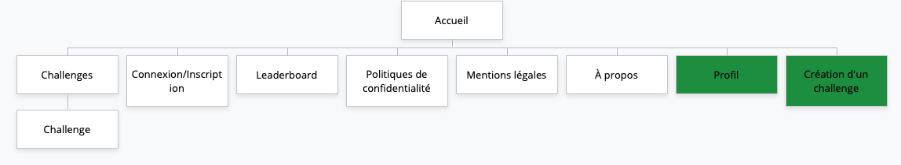

# Gamer Challenges

## Présentation Générale

Gamer challenges et une plateforme dédiée aux défis de jeux vidéo, permettant aux utilisateurs de proposer et relever des challenges sur différents jeux.
Cette plateforme vise à rassembler les amateurs de jeux vidéo, quel que soit leur niveau, cherchant à se mesurer aux autres et à partager leurs expériences.

## MVP

### Le site comprend:
- **une page d'accueil**, présentant les GamerChallenges, des défis en cours et populaires.
- Une **page de inscription/connexion** qui permet de gérer les utilisateurs
- **page utilisateur** pour permettre de créer de nouveaux challenges et visualiser ceux déjà postés. Possibilité de modifier les informations du profile
- **Page de détail d'un challenge** comprend la description, les règles et vidéos des participants
- **Page des challenges** 
- **Tableau des leaders** Affiche les utilisateurs ayant réalisé le plus de défis

## Evolutions possibles
- Système de votation offre la possibilité aux utilisateurs de votés pour chaques challenges et participations.
- Système de commentaires 
- filtre de recherche
  - jeux, popularité, type, difficultées, catégories, popularités.
- système de récompenses
  - badges
- back-office admin

## La liste des technologies 

- Back-end

Node.js Express pour l'API REST et PostgreSQL pour la base de données

- Front-end

React avec TypeScript

## Public visé
Tous les utilisateurs, amateurs de jeux vidéos et défis

## Navigateurs compatibles
- Safari 18.4
- Modzilla firefox 137.0
- Google chrome 135.0

## Arborescence de l'application

légende : 
 - les pages vertes ne sont accessibles que par les utilisateurs connectés.

## Routes

- Challenges

| Verbe | Chemin        |  Response Body  | Code (succès) |
| ----- | ------------- | ------------ | --------------- |
| GET   | /challenges     | un tableau de challenges | 200      |
| GET   | /challenges/:id | un challenge            | 200          |
| POST  | /challenges  | les données du challenge | 201 |
| PATCH  | /challenges/:id | le challenge mis à jour | 200 |
| DELETE | /challenges/:id |   | 204 |

- Categories

| Verbe | Chemin     | Response Body  | Code (succès) |
| ----- | ---------- | ------------ | ----------- |
| GET   | /categories     | un tableau de catégories | 200         |
| GET   | /categories/:id | une catégorie             | 200         |
| POST  | /categories   | les données de la catégorie | 201  |
| PATCH | /categories/:id | la catégorie mise à jour | 200 |
| DELETE | /categories/:id |  | 204 |

- Difficulties

| Verbe | Chemin     | Response Body   | Code (succès) |
| ----- | ---------- | ------------ | ----------- |
| GET   | /difficulties     | un tableau de difficultés | 200         |
| GET   | /difficulties/:id | une difficulté             | 200         |
| POST  | /difficulties   | les données d'une difficulté | 201  |
| PATCH | /difficulties/:id |  la difficulté mise à jour | 200 |
| DELETE | /difficulties/:id |  | 204 |

- Users

| Verbe | Chemin     | Response Body       | Code (succès) |
| ----- | ---------- |  -------------------| ----------- |
| GET   | /users     | un tableau d'utilisateurs | 200         |
| GET   | /users/:id | un utilisateur            | 200         |
| POST  | /users   | les données d'un utilistateur | 201  |
| PATCH | /users/:id |  l'utilisateur mis à jour | 200 |
| DELETE | /users/:id |  | 204 |

- Submissions

| Verbe | Chemin     | Response Body       | Code (succès) |
| ----- | ---------- | ------------------- | ----------- |
| GET   | /submissions     | un tableau des participations | 200         |
| GET   | /submissions/:id |  une participation            | 200         |
| POST  | /submissions   | les données d'une participation | 201  |
| PATCH | /submissions:id | la participation mise à jour | 200 |
| DELETE | /submissions/:id |  | 204 |

## User stories

|En tant qu'utilisateur | je souhaite.. | afin de...|
| ---- | ------ | ----- |
| non connecté | accéder à la home page | les challenges les plus populaires et en cours |
| non connecté | accéder aux différentes rubriques du site | choisir ce que je vais consulter |
| non connecté | accéder à la page d'inscription/connexion | de créer un compte ou accéder à mon compte |
| non connecté | consulter la page des challenges | motiver à participer |
| non connecté | consulter le leaderboard | voir les meilleurs joueurs et les challenges les plus populaires |
| non connecté | voir les participations aux challenges | me divertir |
| connecté | accéder à mon profil | le personnaliser/le modifier/le supprimer |
| connecté | pouvoir créer un nouveau challenge | challenger les autres utilisateurs |
| connecté | modifier un challenge que j'ai créé | corriger une erreur ou ajouter un élément |
| connecté | supprimer un challenge de j'ai créé | ne plus le voir |
| connecté | participer à un challenge | de tester mes capacités dans l'art du jeu vidéo |
| connecté | voir ma position dans le classement des participants | voir mon écart avec les autres participants |
| administrateur | modérer le site | m'assurer de la qualité du contenu |

## Rôles 

- Product owner : Sandrine
- Scrum master : Kishan
- Lead dev back : Mathias
- Lead dev front : Kishan
- Git master : Benjamin

## Charte graphique 

- Logos 
  - 
  - 
  
- Polices d'écritures :
  - JOTI ONE
  - JURA

- Couleurs :
  - #FFFFFF
  - #285CEC
  - #8692FA
  - #6778A7
  - background: #5017A1 -> #1D083B

